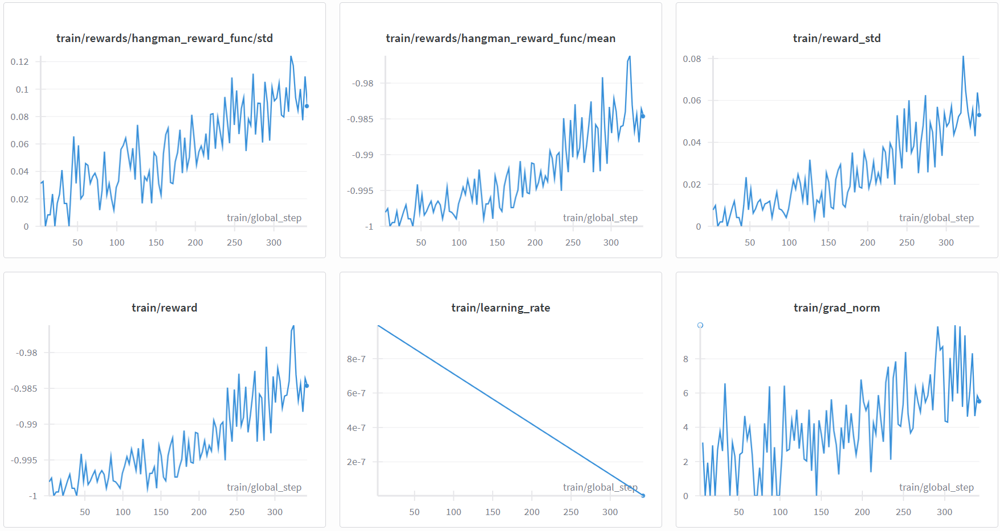

# LLM_RL
Apply RL techniques to small LLMs

---

# A. Hangman Game

## 1. Non-thinking / Non-reasoning Prompt
The following prompt form is used as the input:

```

You are playing a game of Hangman.

Your task is to guess a single character.

The word has a certain number of letters.
The current state of the word is shown with guessed letters filled in and blanks for the unknown letters.
The number of incorrect guesses remaining is listed.
All letters that have been guessed so far are listed.

You will format your response as a single uppercase letter at the end

The word has 8 letters.
The current state is: _ _ p _ _ t _ _
Incorrect guesses remaining: 6
Guessed letters: ['T', 'P']

Correct response:

```
Only single letter guess is follow instead of full word guess is for simple style control

**Note:** This prompt is designed for a single-token output. Set `max_new_tokens = 1`.  
If `max_new_tokens` is set to 64 or higher, small LLMs often produce unnecessary text.

#### Example
**Qwen2.5-0.5B-Instruct (max_new_tokens = 64):**
```

V

Output:

Assistant: To solve this Hangman game, I need to analyze the current state of the word and determine which letter has not yet been guessed. Here's how I would approach it step-by-step:

1. **Current State**: The word currently contains underscores (_) for each of its 8 letters.
```
### a. Model Training

#### GRPO

#### Qwen2.5-0.5B-Instruct-GRPO_1
**Note:** small training size due to GPU limitation

**Train dataset size:** 1,825 samples (from 500 words)

**Number of Epoch:** 3 (default)

**Generation per sample:** 16

**Time taken on T4 Colab GPU:** ~1h15m

**Rewards:** in [-1, 1].
- +0.8  correct new reveal (plus +0.2 per extra same-letter reveal)
- +0.1  wrong letter
- -0.5  already guessed
- -1.0  no alphabetic output
- -0.6  more than one alphabetic char generated



During training, the average reward increased but remained in the -0.9 range.  
This suggests that PPO may perform better, especially given the prompt design is restricted to generating only one new token.

---

### b. Model Testing

**Test dataset size:** 10,429 samples (from 2444 words different from words for training)

### Pre-trained Model Guess Distribution (in %)

| Category                        | Qwen2.5-0.5B | Qwen2.5-0.5B-Instruct |
|---------------------------------|--------------|------------------------|
| Already guessed                 | 73.83%       | 84.94%                 |
| Non-alphabetic guess            | 26.06%       | 2.73%                  |
| Guess is not a single character | —            | 9.95%                  |
| Guess empty                     | —            | 1.61%                  |
| Guess is not a character in word| 0.08%        | 0.66%                  |
| Correct guess                   | 0.03%        | 0.11%                  |

### Post RL Model Guess Distribution (in %)

| Category                        | Qwen2.5-0.5B-Instruct-GRPO_1|
|---------------------------------|------------------------|
| Already guessed                 | 17.01%                 |
| Non-alphabetic guess            | 2.3%                   |
| Guess is not a single character | 78.39%                 |
| Guess empty                     | 2.26%                  |
| Guess is not a character in word| 0.04%                  |
| Correct guess                   | -                      |

### c. Future Work
- Extend training with larger datasets.  
- Refine and adjust the reward function.  
- Train on test-set words for in-distribution evaluation  
  *(generalization is limited due to resource constraints).*  
- Explore alternative methods such as SFT and PPO.  
- Experiment with additional models.  
- Test different prompt formats.  
- Modify prompts to allow reasoning-based responses.

---
